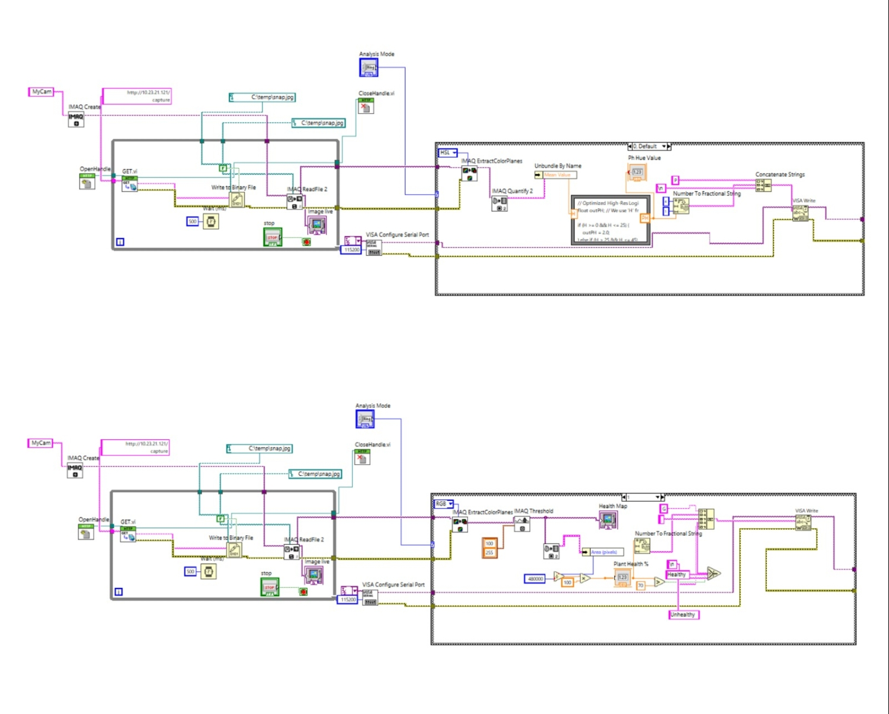
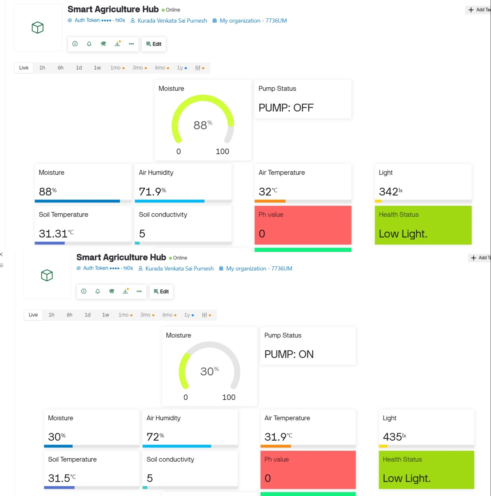

# smart-plant-monitoring-system
IoT-based plant monitoring system using ESP32, LabVIEW, and Blynk — combines autonomous moisture-triggered irrigation, multi-sensor soil health logging (pH, EC, temp), and camera-based Green Ratio plant health tracking on a synchronized mobile/web dashboard.

Developed as a B.Tech 4th Semester Mini Project (EE2191) at the **Department of Electrical Engineering, IIEST Shibpur**.

---

## Overview

Traditional gardening and small-scale farming often suffer from inconsistent watering and delayed detection of nutrient or health issues. This project addresses that with a low-cost, ESP32-based system that continuously monitors three core plant health vectors:

1. **Water** — soil moisture, with autonomous pump control
2. **Soil composition** — pH, Electrical Conductivity (EC), and temperature
3. **Visual health** — leaf color analysis via camera + LabVIEW

The system uses a **distributed processing model**: the ESP32 handles real-time sensing and actuation, while a companion LabVIEW application on a local PC performs computationally heavier image analysis (pH detection via HSL color mapping, and Green Ratio–based chlorophyll density analysis), pushing results back to the cloud via the Blynk REST API.

---

## Features

- **Autonomous Irrigation (Mode 0)** — Hysteresis-based control (pump ON below 30% moisture, OFF above 70%) to prevent relay flicker and overwatering.
- **Soil Health Logger (Mode 1)** — Fuses 6 local sensor readings (moisture, air temp, humidity, light, EC, soil temp) with an optional 7th parameter (pH) pushed from LabVIEW, and produces a combined diagnostic string.
- **Plant Health Tracking (Mode 2)** — ESP32-CAM streams video to LabVIEW, which computes a Green Ratio index `G / (G+R+B)` to flag early chlorosis/stress before it's visible to the eye.
- **Synchronized Dual Dashboard** — Real-time mobile app and web dashboard via Blynk IoT Cloud, updating in under 500ms.
- **Power-Aware Design** — Deep Sleep routines for field/battery deployment.
- **Fault-Tolerant Diagnostics** — Gracefully falls back to 6-parameter diagnosis if the LabVIEW pH value hasn't arrived yet.

---

## System Architecture

```
 Sensing Layer                Processing Layer              Cloud / UI Layer
┌──────────────────┐        ┌────────────────────┐        ┌───────────────────┐
│ Moisture Sensor   │        │                     │        │                   │
│ DS18B20 (Soil T)  │──────▶│   ESP32 (Wi-Fi MCU) │───────▶│  Blynk IoT Cloud  │
│ DHT22 (Air/Hum)   │        │  Irrigation logic,  │  REST  │  (Mobile + Web    │
│ LDR (Light)       │        │  hysteresis, sleep  │  API   │   Dashboards)     │
│ EC Probe          │        │                     │        │                   │
│ ESP32-CAM         │───┐    └────────────────────┘        └───────────────────┘
└──────────────────┘   │              ▲
                        │  image       │ pH, Green Ratio
                        ▼  stream      │ pushed via REST
                 ┌─────────────────────┴───┐
                 │   LabVIEW (local PC)     │
                 │  HSL pH detection,       │
                 │  Green Ratio analysis    │
                 └──────────────────────────┘
```

---

## Hardware Components

| Component | Function |
|---|---|
| ESP32 Dev Module | Central controller, Wi-Fi + Blynk communication |
| Capacitive Soil Moisture Sensor | Corrosion-resistant moisture sensing |
| DS18B20 | Waterproof digital soil temperature probe (1-Wire) |
| DHT22 | Air temperature & humidity |
| LDR | Ambient light sensing |
| DIY EC Probe | Electrical conductivity / nutrient concentration |
| ESP32-CAM | Video streaming for pH & plant health analysis |
| 1-Channel Relay + Mini Water Pump | Irrigation actuation |

Full Bill of Materials is in the [project report](./docs/Smart_Plant_Monitoring_Report.pdf) (Appendix A).

---

## Software Stack

| Layer | Tool | Role |
|---|---|---|
| Firmware | Arduino IDE (ESP32 core) | Sensor reading, control logic, Wi-Fi/Blynk comms |
| Image Processing | LabVIEW + Vision Development Module | HSL-based pH detection, Green Ratio calculation |
| Cloud | Blynk IoT | Data storage, visualization, remote control, alerts |

---

## Blynk Virtual Pin Map

| Pin | Parameter | Type | Source |
|---|---|---|---|
| V0 | Soil Moisture (%) | Integer | ESP32 |
| V1 | Pump Status | String | ESP32 |
| V2 | Air Temperature | Double | ESP32 |
| V3 | Humidity | Integer | ESP32 |
| V4 | Light | Double | ESP32 |
| V5 | Electrical Conductivity | Float | ESP32 |
| V6 | Soil Temperature | Float | ESP32 |
| V7 | pH Value | Float | LabVIEW |
| V8 | Green Ratio (%) | Float | LabVIEW |
| V9 | Plant Health Status | String | LabVIEW |
| V10 | Mode Selector | Integer | Mobile/Web |
| V12 | Overall Soil Health | String | ESP32 |

---

## Repository Structure

```
smart-agriculture-hub/
├── firmware/
│   ├── smart_agriculture_hub.ino     # Main ESP32 sensor + control firmware
│   └── esp32_cam_streamer.ino        # ESP32-CAM video streaming server
├── labview/                          # LabVIEW VIs for pH & Green Ratio analysis
├── docs/
│   └── Smart_Plant_Monitoring_Report.pdf
├── images/                           # Circuit diagrams, dashboard screenshots
├── secrets.h.example                 # Template for Wi-Fi/Blynk credentials
├── .gitignore
└── README.md
```

---

## Getting Started

1. Clone this repo:
   ```bash
   git clone https://github.com/<your-username>/smart-agriculture-hub.git
   ```
2. Copy `secrets.h.example` to `secrets.h` and fill in your own Wi-Fi and Blynk credentials:
   ```cpp
   #define WIFI_SSID "your_wifi_name"
   #define WIFI_PASS "your_wifi_password"
   #define BLYNK_AUTH "your_blynk_auth_token"
   ```
3. Open `firmware/smart_agriculture_hub.ino` in Arduino IDE, install the required libraries (`Blynk`, `DHT sensor library`, `OneWire`, `DallasTemperature`), select your ESP32 board, and upload.
4. Flash `firmware/esp32_cam_streamer.ino` to the ESP32-CAM separately.
5. Set up the Blynk template using the Virtual Pin map above, and create your dashboard widgets.
6. Run the LabVIEW VIs on a local PC pointed at the ESP32-CAM's stream URL.



---


## Results

- Sensor accuracy validated against commercial instruments: **95.5%–99.5%** across pH, EC, temperature, and moisture.
- Hysteresis irrigation logic reliably activated/deactivated at the 30%/70% moisture thresholds with no relay flicker.
- Deep Sleep routines significantly reduced average current draw for field/battery viability.

---




## Future Scope

- Machine learning–based predictive irrigation and disease classification
- LoRa mesh networking for multi-acre / multi-node deployment
- Solar energy harvesting for full self-sufficiency
- Precision fertigation via peristaltic pumps
- 5G/NB-IoT for edge-based video diagnostics (removing the local LabVIEW PC dependency)

---

## Team — Green Revolution

- Aaryan Raj Gond (2024EEB033)
- Eepuri Srikavya (2024EEB047)
- Jannat Parvin (2024EEB019)
- Kurada Venkata Sai Purnesh (2024EEB089)
- Toy Tayeng (2024EEB076)

**Mentor:** Dr. Anindita Sengupta
**Department of Electrical Engineering, IIEST Shibpur**

